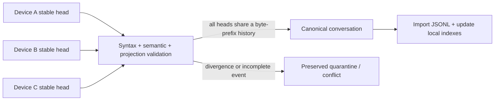

# Codex Sync

**English** | [简体中文](README.zh-CN.md)

**Continue the same local Codex project on your trusted computers—without copying credentials, live databases, or unfinished turns.**

Codex Sync is a local-first continuity layer for developers who move between Windows, macOS, and Linux and want their selected projects, task histories, and personal skills to travel safely with them.

> The product and Codex Skill are **Codex Sync** / `$codex-sync`. The shell CLI is `codexsync`—not `sync`—to avoid colliding with operating-system utilities. Local protocol state lives under `.codex-sync/`.

```text
$ codexsync conversation select current
Selected: Example task

$ codexsync sync
conversationsPushed: 1   conversationConflicts: 0

$ codexsync doctor
ok: true
```

## Why Codex Sync exists

Local Codex work is rooted in the computer where it runs: a task records its transcript and working directory, while a local project connects to folders on that machine. That is a useful safety boundary, but signing into the same account on another trusted computer does not by itself recreate the same local workspace and task history.

Imagine a normal day. You start a project on an office workstation in the morning. In the afternoon, you open a MacBook beside a river or at the beach and want to continue. After dinner, while the family settles into a long TV episode, you open a Windows laptop on the couch—and expect the morning's Codex project, tasks, and context to be there. Your Git repository may already have the code, but the local Codex continuity can still be stranded on another device.

**That continuity gap—not generic backup—is why Codex Sync exists.**

Blindly copying `~/.codex` is not the answer: it mixes credentials, device identity, live SQLite state, caches, and partially written turns. Generic file synchronization also cannot tell which Codex events form a complete, recoverable conversation.

Codex Sync adds that missing semantic layer:

- select only the tasks worth carrying between devices;
- publish only complete JSONL and stable, closed turns;
- keep independent device heads and promote a canonical history only when they are byte-prefix compatible;
- quarantine incomplete or divergent history instead of inventing a merge;
- synchronize personal skill collections with three-way hashes and preserved conflict copies;
- update local Codex indexes without copying another device's database;
- discover Codex Projects, select their tasks as a group, and map project roots across Windows and macOS.

## Quick start

Requirements: Node.js 22+, Codex initialized once on each device, and a trusted shared folder or checked-out private Git vault.

> **Upgrading an existing fleet to v0.3:** pause vault transport and stop the scheduler installed by the earlier release on every device first. Back up the shared vault and each device's local state, then rebootstrap all devices as one coordinated upgrade. The Skill, state directory, and scheduler identities changed; pre-v0.3 and v0.3 writers must never share a live vault.

Install as a Codex skill:

```sh
git clone https://github.com/ToussaintKnight/codex-sync.git
npm install --global ./codex-sync
mkdir -p "$HOME/.codex/skills/codex-sync"
cp -R codex-sync/. "$HOME/.codex/skills/codex-sync/"
```

Initialize one device:

```sh
codexsync init \
  --vault "$HOME/CodexSyncVault" \
  --transport folder \
  --device mac-main
```

Then invoke `$codex-sync current` inside the Codex task you want to preserve. Run `$codex-sync doctor` before enabling automatic scheduling.

Windows and macOS cold-start commands are in the [deployment guide](references/deployment.md).

> **Security note:** the operational vault stores selected conversation text and user skill source in plaintext. Codex Sync never copies credentials or complete Codex databases. Use only storage and peers you trust; see [Security and privacy](SECURITY.md).

## How it works



Syncthing or private Git transports bytes. Codex Sync decides which bytes are a safe Codex conversation. Read the [architecture](docs/architecture.md) and [protocol](references/protocol.md) for the invariants.

## Evidence that it works

```sh
npm run check
```

The deterministic suite runs 70 checks across folder and Git transports, project discovery and task selection, cross-platform project path mapping, interrupted-event recovery, legacy abort repair, stable active checkpoints, conflict preservation, Windows extended paths, desktop catalog updates, maintenance mode, device reports, and skill reconciliation.

GitHub Actions runs the same privacy gate and tests on Windows, macOS, and Linux with Node.js 22. The fixtures use isolated temporary Codex homes and synthetic conversations; they never read the user's real vault.

## Data boundaries

Included:

- explicitly selected rollout JSONL;
- portable task metadata;
- user-defined skill files;
- device selection events and health reports;
- per-device project catalogs and explicit source-to-local path mappings.

Excluded:

- `auth.json`, tokens, API keys, installation and device credentials;
- `config.toml`, complete SQLite/WAL databases, logs, caches, and models;
- attachments and generated images;
- system and plugin-managed skill caches;
- arbitrary project content unless registered separately.

## Limitations

- Conversation attachments are not copied.
- Independently continuing the same task while devices are disconnected creates an explicit conflict requiring a human choice.
- Codex Sync does not encrypt the vault itself.
- Older clients do not understand maintenance mode; disable their schedulers before a fleet upgrade.
- Windows, macOS, and Linux are supported. Linux automatic scheduling uses optional `systemd --user`; manual sync never depends on it. iPhone and Android continuity is future scope and depends on compatible Codex storage and execution surfaces.
- Codex storage formats may evolve; run `doctor` and the test suite after Codex upgrades.

## Safety verification

`node scripts/codexsync.mjs verify --json` is a read-only audit of the vault,
selected rollout semantic health, operational paths, and the protected
`thread_history_1.sqlite` fingerprint. `conversation verify <id-or-title>`
narrows the same audit. Cosmetic title disagreement is a warning; forbidden
SQLite transport files and unsafe operational state fail.

Push, pull, and sync reuse preflight and postflight verification. Canonical
JSONL and heads are transport data; SQLite remains local and is never copied
to the vault. Historical JSONL paths are byte-preserved, while operational
`cwd` and `rollout_path` are localized by path mapping. `--dry-run` writes no
state.

## Documentation

- [Demonstration](docs/demo.md)
- [Architecture](docs/architecture.md)
- [Usage guide](references/usage.md)
- [Deployment and cold start](references/deployment.md)
- [Protocol and recovery](references/protocol.md)
- [Roadmap](docs/roadmap.md)
- [Security policy](SECURITY.md)
- [Contributing](CONTRIBUTING.md)

## Project status

Codex Sync is an early, tested engineering project. The current release is intended for users comfortable inspecting local files, backups, and synchronization health. Safety and recoverability take priority over automatic conflict resolution.

## License

MIT. See [LICENSE](LICENSE).
