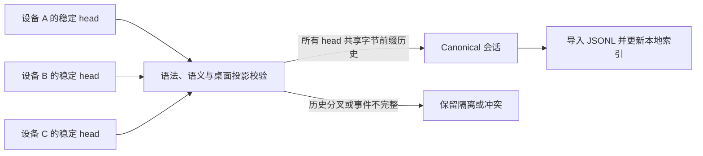

# Codex Sync

[English](README.md) | **简体中文**

**在自己信任的不同电脑上继续同一个本地 Codex 项目，同时不复制凭据、运行中的数据库或尚未完成的回合。**

Codex Sync 是一个本地优先的连续工作层，面向需要在 Windows 与 macOS 之间切换，并希望安全携带已选择项目、任务历史和个人 Skill 的开发者。

> 产品与 Codex Skill 的正式名称是 **Codex Sync** / `$codex-sync`。Shell CLI 使用 `codexsync`，而不是容易与操作系统工具冲突的 `sync`；本地协议状态存放在 `.codex-sync/`。

```text
$ codexsync conversation select current
Selected: Example task

$ codexsync sync
conversationsPushed: 1   conversationConflicts: 0

$ codexsync doctor
ok: true
```

## 为什么需要 Codex Sync

本地 Codex 工作扎根于实际运行它的电脑：任务会记录对话和工作目录，本地项目则连接到这台机器上的文件夹。这是一条有价值的安全边界，但即使在另一台可信电脑上登录同一个账号，也不会自动重建完全相同的本地工作区与任务历史。

想象普通的一天：早晨你在办公室工作站新建一个项目；下午带着 MacBook 到河边或海边，想接着做；晚饭后，全家在沙发上看一集很长的电视剧，你又打开另一台 Windows 笔记本，希望继续早晨那条 Codex 任务。代码也许已经通过 Git 到了新设备，但本地 Codex 项目、任务和上下文仍可能留在另一台电脑上。

**Codex Sync 正是为这个“连续工作缺口”而生，而不只是为了普通备份。**

直接复制 `~/.codex` 并不是答案：其中混合了凭据、设备身份、正在写入的 SQLite 状态、缓存和未完成回合。普通文件同步工具也无法判断哪些 Codex 事件才能构成完整、可恢复的会话。

Codex Sync 补上了这一层语义安全能力：

- 只选择真正需要跨设备保留的任务；
- 只发布完整 JSONL 和稳定、已关闭的回合；
- 为每台设备保留独立 head，仅在历史满足字节前缀关系时提升 canonical；
- 隔离不完整或分叉历史，而不是虚构合并结果；
- 通过三方哈希同步个人 Skill，并保留冲突副本；
- 更新本地 Codex 索引，而不是复制其他设备的数据库；
- 发现 Codex Projects、按项目批量选择任务，并映射 Windows 与 macOS 的不同项目路径。

## 快速开始

要求：Node.js 22+、每台设备至少启动过一次 Codex，以及一个可信共享文件夹或已检出的私有 Git vault。

> **将现有设备集升级到 v0.3：**先在每台设备上暂停 vault 传输，并停止旧版本安装的调度器。备份共享 vault 与每台设备的本地状态，再把所有设备作为一次受控升级重新 bootstrap。Skill、状态目录和调度器标识都已变化；绝不能让 v0.3 之前的客户端与 v0.3 客户端同时写入在线 vault。

安装为 Codex Skill：

```sh
git clone https://github.com/ToussaintKnight/codex-sync.git
npm install --global ./codex-sync
mkdir -p "$HOME/.codex/skills/codex-sync"
cp -R codex-sync/. "$HOME/.codex/skills/codex-sync/"
```

初始化一台设备：

```sh
codexsync init \
  --vault "$HOME/CodexSyncVault" \
  --transport folder \
  --device mac-main
```

随后在需要保留的 Codex 任务中调用 `$codex-sync current`。启用自动调度前先运行 `$codex-sync doctor`。

Windows 与 macOS 的冷启动命令见[部署指南](references/deployment.md)。

> **安全提示：**实际运行的 vault 会以明文保存已选择的会话文本与用户 Skill 源码。Codex Sync 不会复制凭据或完整 Codex 数据库。请只使用你信任的存储与对等设备；详见[安全与隐私](SECURITY.zh-CN.md)。

## 工作原理



Syncthing 或私有 Git 负责传输字节；Codex Sync 负责判断哪些字节构成安全的 Codex 会话。关键约束见[架构说明](docs/architecture.zh-CN.md)与[协议文档](references/protocol.md)。

## 可验证的工程证据

```sh
npm run check
```

确定性测试套件包含 70 项检查，覆盖文件夹与 Git 传输、项目发现与任务选择、跨平台项目路径映射、中断事件恢复、旧式 abort 修复、活动回合稳定检查点、冲突保留、Windows 扩展路径、桌面目录更新、维护模式、设备报告和 Skill 同步。

GitHub Actions 在 Windows、macOS 和 Linux 的 Node.js 22 环境中运行同一套隐私 gate 与测试。测试使用隔离的临时 Codex home 和合成会话，不读取用户的真实 vault。

## 数据边界

包含：

- 明确选择的 rollout JSONL；
- 可移植任务元数据；
- 用户自定义 Skill 文件；
- 设备选择事件与健康报告；
- 每设备项目目录与显式的源路径到本地路径映射。

排除：

- `auth.json`、token、API key、安装和设备凭据；
- `config.toml`、完整 SQLite/WAL 数据库、日志、缓存和模型；
- 附件与生成图片；
- 系统和插件管理的 Skill 缓存；
- 未单独注册的任意项目内容。

## 限制

- 不复制会话附件。
- 设备离线期间若在多端独立继续同一任务，会产生需要人工选择的显式冲突。
- Codex Sync 本身不加密 vault。
- 旧版客户端不理解维护模式；升级整个设备集前必须禁用旧调度器。
- 当前支持 Windows 与 macOS。iPhone 和 Android 连续工作属于未来范围，并依赖兼容的 Codex 存储与执行界面。
- Codex 存储格式可能变化；Codex 升级后应运行 `doctor` 与测试套件。

## 安全验证

`node scripts/codexsync.mjs verify --json` 是只读审计，检查 vault、已选择
rollout 的语义健康度、运行路径及受保护的 `thread_history_1.sqlite` 指纹。
`conversation verify <id-or-title>` 将审计限定到一条会话。标题外观差异是
warning；禁止的 SQLite 传输文件和不安全运行状态会失败。

push、pull 与 sync 复用 preflight 和 postflight 验证。canonical JSONL 与 heads
是传输数据；SQLite 始终保持本地，绝不会复制到 vault。历史 JSONL 路径按字节保留，
运行 `cwd` 和 `rollout_path` 则通过 path mapping 本地化。`--dry-run` 不写入状态。

## 文档

- [演示](docs/demo.zh-CN.md)
- [架构](docs/architecture.zh-CN.md)
- [使用指南（英文）](references/usage.md)
- [部署与冷启动（英文）](references/deployment.md)
- [协议与恢复（英文）](references/protocol.md)
- [路线图](docs/roadmap.zh-CN.md)
- [安全策略](SECURITY.zh-CN.md)
- [贡献指南](CONTRIBUTING.zh-CN.md)

## 项目状态

Codex Sync 是一个处于早期阶段、但已有完整测试的工程项目。目前版本面向愿意检查本地文件、备份与同步健康状态的用户。安全与可恢复性优先于自动冲突合并。

## 许可证

MIT，详见 [LICENSE](LICENSE)。
